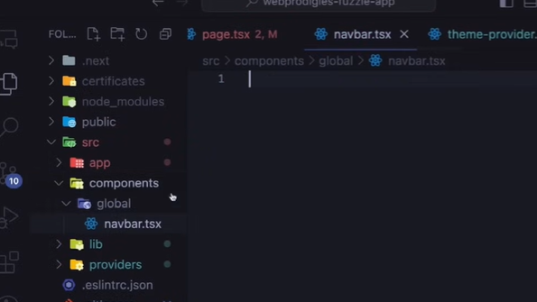
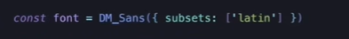

# 15 May

## Project Setup

1. Initialize the project with shad cn
2. Copy the globals.css
3. Install `npm i framer-motion clsx tailwind-merge`
4. For Dark mode, install `npm install next-themes`
5. Follow the shadcn docs to implement theme provider.
6. We can use --experimental-https in package.json.
7. Create main route group.

## Navbar

1. Create Navbar.tsx file like this
   
2. Create navbar content like this
   https://github.com/webprodigies/fuzzie-production/blob/main/src/components/global/navbar.tsx
3. To change the font, replace DM_sans with inter and add this.
   

4. Copy the remaining code from above link
5. Replace the tailwind file with the repo file.

# 16 May

## Creating Landing page

1. Just copy the dashboard code from git repo. Don't take much time going through css.

## Creating Sidebar

1. Create sidebar in components

# 17 May

1. Create infobar component
2. Import the infobar in layout with sidebar
3. Copy the .env
4. Create setting page
5. Create profile-form in components/form and install shad cn form

# 18 May

1. Completed the profile form